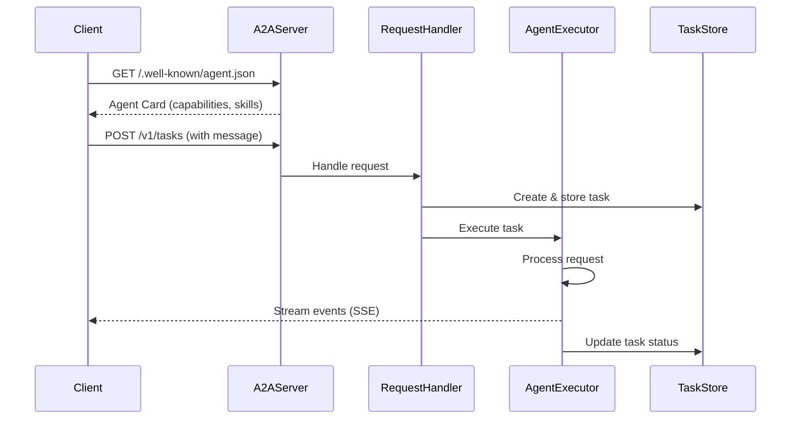

# SAP BRIM A2A Agent - Architecture Guide

## 🏗️ A2A Architecture Overview

### What is Agent-to-Agent (A2A)?

A2A is a **standardized protocol** for enabling AI agents to discover, communicate, and collaborate with each other. Think of it as "HTTP for AI agents."

### Core Concepts

#### 1. **Agent Card** 
A JSON document that describes an agent's capabilities (like an API documentation page):

```json
{
  "name": "SAP BRIM Hello World Agent",
  "version": "0.1.0",
  "url": "http://localhost:8000/",
  "skills": [
    {
      "id": "sap_brim_hello",
      "name": "SAP BRIM Hello World",
      "description": "A simple greeting agent",
      "examples": ["hi", "hello"]
    }
  ],
  "capabilities": {
    "streaming": true
  }
}
```

#### 2. **Agent Executor**
The business logic that processes requests:

```python
class SAPBRIMAgentExecutor(AgentExecutor):
    async def execute(self, context, event_queue):
        # 1. Extract user input from context
        # 2. Process the request (call SAP APIs, LLM, etc.)
        # 3. Send response via event queue
```

#### 3. **Request Flow**



### Key Components in This Project

#### File Structure

```
sap-brim-agent-a2a/
│
├── __main__.py                 # Server entry point
│   ├── Defines Agent Card
│   ├── Creates AgentExecutor
│   ├── Sets up A2A server
│   └── Starts HTTP server
│
├── agent_executor.py          # Business logic
│   ├── SAPBRIMHelloWorldAgent (your agent)
│   └── SAPBRIMAgentExecutor (A2A interface)
│
├── test_client.py             # Test client
│   ├── Fetches Agent Card
│   ├── Sends messages
│   └── Receives streaming responses
│
└── pyproject.toml/requirements.txt  # Dependencies
```

## 🔄 Request/Response Flow

### 1. Agent Discovery

```
Client → GET /.well-known/agent.json → Server
Client ← Agent Card JSON ← Server
```

The client discovers what the agent can do by fetching its Agent Card.

### 2. Task Submission (Non-Streaming)

```
Client → POST /v1/tasks → Server
         {
           "message": {
             "role": "user",
             "parts": [{"kind": "text", "text": "Hello"}]
           }
         }

Client ← Task Response ← Server
         {
           "id": "task-123",
           "status": "completed",
           "events": [...]
         }
```

### 3. Task Submission (Streaming)

```
Client → POST /v1/tasks?stream=true → Server
Client ← Server-Sent Events (SSE) ← Server
         data: {"type": "message", "text": "Hello..."}
         data: {"type": "status", "status": "completed"}
```

## 🧩 Extending This Agent

### Adding SAP BRIM Functionality

#### Step 1: Add Dependencies

```toml
# pyproject.toml
dependencies = [
    "a2a-sdk>=0.3.0",
    "httpx>=0.28.1",
    "pydantic>=2.11.4",
    # Add SAP libraries
    "your-sap-library>=1.0.0",
]
```

#### Step 2: Create SAP Client

```python
# sap_client.py
class SAPBRIMClient:
    def __init__(self, base_url: str, api_key: str):
        self.base_url = base_url
        self.api_key = api_key
    
    async def get_subscription(self, sub_id: str):
        # Call SAP BRIM API
        pass
```

#### Step 3: Update Agent Executor

```python
# agent_executor.py
class SAPBRIMAgentExecutor(AgentExecutor):
    def __init__(self, sap_client: SAPBRIMClient):
        self.sap_client = sap_client
        self.agent = YourLLMAgent()  # LangChain, etc.
    
    async def execute(self, context, event_queue):
        # Extract user query
        user_query = extract_text(context.request.params.message)
        
        # Parse intent (using LLM or rule-based)
        intent = await self.agent.parse_intent(user_query)
        
        # Call SAP BRIM API
        if intent.action == "get_subscription":
            data = await self.sap_client.get_subscription(intent.sub_id)
        
        # Format response
        response = format_response(data)
        
        # Send to client
        await event_queue.enqueue_event(new_agent_text_message(response))
```

#### Step 4: Define Skills

```python
# __main__.py
skills = [
    AgentSkill(
        id='get_subscription',
        name='Get Subscription Details',
        description='Retrieve subscription order information from SAP BRIM',
        examples=[
            'show me subscription 12345',
            'get details for order 67890',
            'what is the status of subscription ABC123'
        ],
        tags=['subscription', 'order', 'sap', 'brim']
    ),
    AgentSkill(
        id='list_products',
        name='List Products',
        description='List available products in SAP BRIM',
        examples=[
            'show all products',
            'list available products',
            'what products do we have'
        ],
        tags=['product', 'catalog', 'sap', 'brim']
    ),
]
```

## 🔐 Security Considerations

### Production Checklist

- [ ] **Authentication**: Implement OAuth2 or API key authentication
- [ ] **Input Validation**: Sanitize all user inputs
- [ ] **Rate Limiting**: Prevent abuse
- [ ] **HTTPS**: Use TLS in production
- [ ] **Secrets Management**: Store credentials securely (not in code)
- [ ] **Logging**: Log all requests for audit
- [ ] **Error Handling**: Don't expose internal errors to clients

### Example: Adding Authentication

```python
# __main__.py
from starlette.middleware import Middleware
from starlette.middleware.authentication import AuthenticationMiddleware

server = A2AStarletteApplication(
    agent_card=agent_card,
    http_handler=request_handler,
    middleware=[
        Middleware(AuthenticationMiddleware, backend=YourAuthBackend())
    ]
)
```

## 🧪 Testing Strategies

### Unit Tests

```python
# test_agent.py
import pytest
from agent_executor import SAPBRIMHelloWorldAgent

@pytest.mark.asyncio
async def test_agent_invoke():
    agent = SAPBRIMHelloWorldAgent()
    result = await agent.invoke("hello")
    assert "Hello" in result
```

### Integration Tests

```python
# test_integration.py
import pytest
from httpx import AsyncClient
from a2a.client import A2AClient

@pytest.mark.asyncio
async def test_end_to_end():
    async with AsyncClient(base_url="http://localhost:8000") as client:
        # Fetch agent card
        response = await client.get("/.well-known/agent.json")
        assert response.status_code == 200
        
        # Send message
        # ... test message sending
```

## 📊 Monitoring & Observability

### Add Logging

```python
import logging

logger = logging.getLogger(__name__)

class SAPBRIMAgentExecutor(AgentExecutor):
    async def execute(self, context, event_queue):
        logger.info(f"Processing task: {context.request.id}")
        try:
            # ... your code
            logger.info(f"Task completed: {context.request.id}")
        except Exception as e:
            logger.error(f"Task failed: {context.request.id}", exc_info=e)
            raise
```

## 📚 Additional Resources

- [A2A Protocol Spec](https://github.com/a2aproject/A2A)
- [A2A Python SDK Docs](https://github.com/google/a2a-python)
- [A2A Samples](https://github.com/a2aproject/a2a-samples)
- [A2A Inspector Tool](https://github.com/a2aproject/a2a-inspector)

## 🤝 Contributing

Feel free to extend this agent with real SAP BRIM functionality!
